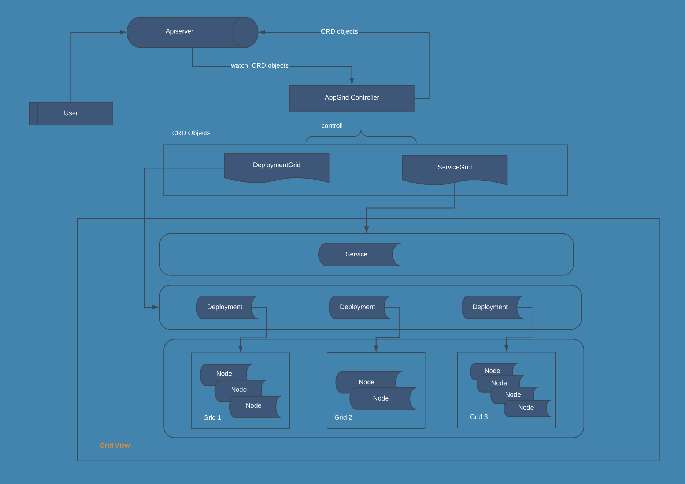

application-grid-design

---
title: Application grid design
date: 2020-03-01 15:00:01
tags: 
    - linux
    - kubernetes
    - crd
---

# Architecture



# Summary

Application grid is a feature to support such a scenario described as following:

- Application is deployed in many grids, each grid has a number of nodes
- The pods in each grid can communiate with the others in the same grid by service, other pods which aren't in the same grid can't be in touch with this grid by service. This can be called service isolation.
- Application keeps some replicas in each grid.

So we create 2 CRD (DeploymentGrid, ServiceGrid) for implements our purpose.

1. ServiceGrid

`ServiceGrid` plays as a template of `Service Topology`, the controller monitors the changes to this objects, then apply them to `Service` spec.

2. DeploymentGrid

`DeploymentsGrid` is a higher-level of concept than `Deployments`. the controller will determine how many `Deployments` in the cluster and the number of replicas in eacho `Deployments`. If the specific label of `Node` changed, controller will re-calculate the `replicas` of each `Deployments` under its control even delete them.


# Proposal

1. ServiceGrid

```yaml
apiVersion: v1alpha1
kind: ServiceGrid
metadata:
  name: servicegrid-demo
  namespace: default
spec:
  gridUniqKey: zone
  data:
    selector:
      appGrid: nginx
    ports:
    - protocol: TCP
      port: 80
      targetPort: 9376
```
`SerivceGrid` is a higher-level concept of `Service` with topology support(1.17) or `kube-proxy-wrapper` installed.

2. DeploymentGrid

```yaml
apiVersion: v1alpha1
kind: DeploymentGrid
metadata:
  name: deploymentgrid-demo
  namespace: default
spec:
  gridUniqKey: zone
  # data is the copy of Deployment without replicas set
  data:
    metadata:
      matchLabels:
        appGrid: nginx
    selector:
      matchLabels:
        appGrid: nginx
    template:
      metadata:
        labels:
          appGrid: nginx
      spec:
        containers:
        - name: nginx
          image: nginx:1.7.9
          ports:
          - containerPort: 80
status:
  - name: grid-1
    availableReplicas: 3
    conditions:
    - lastTransitionTime: "2020-03-02T07:30:01Z"
      lastUpdateTime: "2020-03-02T07:30:01Z"
      message: Deployment has minimum availability.
      reason: MinimumReplicasAvailable
      status: "True"
      type: Available
    - lastTransitionTime: "2020-03-02T07:29:02Z"
      lastUpdateTime: "2020-03-02T07:30:01Z"
      message: ReplicaSet "nginx-deployment-54f57cf6bf" has successfully progressed.
      reason: NewReplicaSetAvailable
      status: "True"
      type: Progressing
    observedGeneration: 1
    readyReplicas: 3
    replicas: 3
    updatedReplicas: 3
```