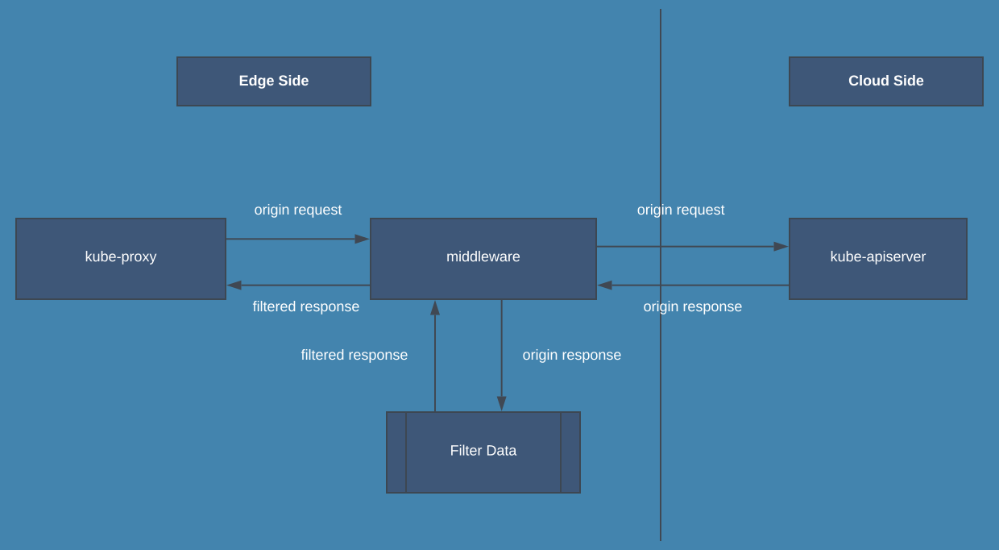

kube-proxy-topology-design

---
title: kube-proxy topology design
date: 2020-01-15 11:12:34
tags: 
    - linux
    - kubernetes
    - hijack
---

# Architecture




# Summary

To support topology in old version kubernetes, we need to add a middleware programm between kube-proxy and kube-apiserver. By this method, we can hijack and modify the data which is sent to kube-proxy. Then we can controll the network rules without change kube-proxy code. We call our programm `kube-proxy-wrapper`.


# Implementation

To keep consistence as much as possible with the latest version of Kubernetes. We also use `kubernetes.io/hostname`, `topology.kubernetes.io/zone` and `topology.kubernetes.io/region` as well-known keys.

We choose a annotation `topologyKeys` for `Service` to indicate topology concerned key, then label nodes with this key and some value to tell `kube-proxy-wrapper` the enpoints this node concerns

```
apiVersion: v1
kind: Service
metadata:
  annotations:
    topologyKeys: '["topology.kubernetes.io/zone"]'
...

apiVersion: v1
kind: Node
metadata:
  labels:
    topology.kubernetes.io/zone: 1001
...
```

`kube-proxy-wrapper` acts as 2 roles. One is reverse proxy called `R`, the other one is to manipulate data retrieved from kube-apiserver called `M`.

For the direction from `kube-proxy` to `kube-apiserver`, `M` won't modify any data. But the direction from `kube-apiserver` to `kube-proxy`, `M` will be involved by filtering the endpoints. So the remaining work are that how `M` get endpoints which it concerns and how network rules flush if node labels are changed.

`M` uses 1 informer to get all nodes of this cluster. This is essential component that can be used to divide endpoints into this node concerned and not-concerned. Through this way, we filter the endpoints that this node concerns. And now we focus on how rule flush if our node labels are changed. According to `kube-proxy` source code, we could send a watch event to `kube-proxy`, make it thought that endpoints has been changed. By this way `kube-proxy` will flush all rules.

